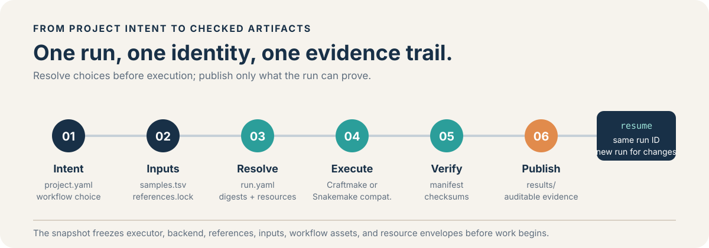

# Otter documentation hub

This directory is the source of truth for current user-facing contracts, operational guidance, and evidence boundaries. Documents are grouped by lifecycle rather than by the date they were written.

  

## Start here

| Need | Read |
| --- | --- |
| Understand the product | [Project overview](project-overview.md) |
| Install a release or source checkout | [Installation](installation.md) |
| Run a first workflow | [User manual](manual/README.md) |
| Understand the execution stack | [Architecture](architecture.md) |
| Choose a workflow scenario | [Workflow catalog](workflow-catalog.md) |
| Resolve canonical files into an immutable run | [Configuration](configuration.md), [execution contract](execution-contract.md) |
| Configure sites and references | [Site profiles](site-profiles.md), [reference registry](reference-registry.md) |
| Build the root or submodules | [Build guide](build.md), [submodule build guide](submodules-build-guide.md) |
| Understand release readiness | [Release readiness](release-readiness.md) |
| Understand accepted Gate 6 evidence | [Gate 6 comparison](gate6-toolchain-comparison-report.md), [evidence register](gate6-closeout-evidence-register.json) |

## Current documentation layers

### Product and user guidance

- [Project overview](project-overview.md) — product hierarchy, current/target runtime, scenarios, and repository layout.
- [Installation](installation.md) — release/source install, environments, verification, and troubleshooting.
- [User manual](manual/README.md) — task-oriented tutorial sequence for new users.
- [Requirements](requirements.md) — current product requirements and boundaries.

### Contracts and reference

- [Architecture](architecture.md)
- [Configuration](configuration.md)
- [Execution contract](execution-contract.md)
- [Project layout](project-layout.md)
- [Site profiles](site-profiles.md)
- [Reference registry](reference-registry.md)
- [Workflow catalog](workflow-catalog.md)
- [Schema directory](schema/)

### Engineering and operations

- [Build guide](build.md)
- [Submodule build guide](submodules-build-guide.md)
- [Benchmark plan](benchmark-plan.md)
- [Paracloud operations](gate6-paracloud-operations.md)
- [Craftmake adoption](migration/craftmake-adoption.md)

### Evidence and project decisions

- [Current context](active_context.md) — compact current-state handoff.
- [Gate 6 evidence register](gate6-closeout-evidence-register.json) — machine-readable acceptance boundary.
- [Gate 6 comparison report](gate6-toolchain-comparison-report.md) — accepted parity and limitation summary.
- [Review index](review/README.md) — dated reviews and remediation evidence.
- [Archive](archive/) — historical implementation records retained as evidence.
- [Notes](notes/) — dated execution handoffs and working records.

## Documentation rules

- Current product docs use `otter`, `craftmake`, `enva`, and the current operator names.
- External standards and scientific names such as FASTQ, FastQC, MultiQC, Bismark, Methrix, HTSeq, rMATS, BAM, and HDF5 are not renamed.
- Historical review, archive, and dated note files preserve the terminology and claims that were true when the evidence was recorded.
- Any deferred Gate 6 work remains explicitly deferred and must not be promoted to a release claim without a new evidence boundary.
- Commands and output paths must be checked against the owning repository's current source before being copied into tutorials.

## Documentation maintenance checklist

When changing a user-facing CLI or output contract:

1. Update the owning submodule README and the root component reference if the integration boundary changes.
2. Update the relevant manual chapter and link it from this hub.
3. Update `skills/otter/` when the build matrix, repository map, or safe operating rules change.
4. Run the README image/link audit and a repository-wide link/terminology check.
5. Keep release limitations visible near the first-use path.
