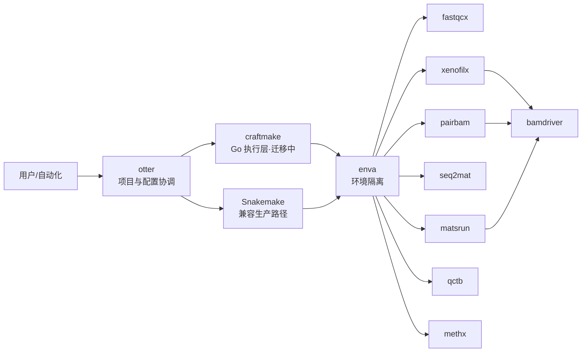
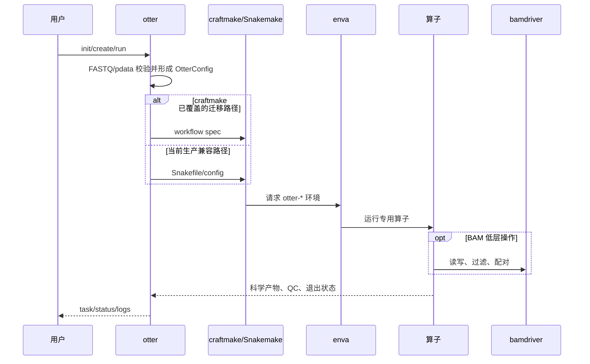

# otter 架构设计

## 架构目标

`otter` 将项目配置、工作流执行、环境隔离和生信算子拆成可独立演进的层。GitHub 主仓为 `rainoffallingstar/otter`。

```text
otter → craftmake → enva → 算子 → bamdriver
```

该箭头表示控制与依赖方向：`otter` 负责用户意图和配置；`craftmake` 负责编译/执行工作流；`enva` 提供可复现环境；算子完成领域计算；`bamdriver` 为需要 BAM 操作的算子提供底层能力。

## 当前迁移状态

`craftmake` 是 Snakemake 的 Go 替代执行层，但尚未完全接入 `otter`。当前架构是双轨：

- 已有生产工作流继续使用嵌入的 Snakemake/Snakefile 资产。
- `craftmake` 开发 Go 原生 workflow spec、DAG、local/SLURM 后端和 otter 适配器。
- 只有在模式覆盖、资源语义、恢复行为和科学输出的集成门禁通过后，才能宣布 Snakemake 替换完成。
- 迁移期保留 `otter-snakemake` 环境；不得把它提前从安装和运行文档删除。

## 分层架构



## 仓库目录

```text
otter/
├── cmd/                  # otter CLI 命令
├── internal/             # config/input/engine/workflow/task/assets
├── pkg/                  # 公共类型与工具
├── inst/                 # 当前 Snakemake、rules、env YAML、辅助脚本资产
├── testdata/             # 单元与端到端 fixtures
├── craftmake/            # Go 工作流执行层
├── enva/                 # 环境管理层
├── fastqcx/              # FASTQ 质控算子
├── xenofilx/             # PDX 物种过滤算子
├── pairbam/              # 配对 BAM 算子
├── seq2mat/              # HTSeq count-to-matrix 算子
├── matsrun/              # rMATS 编排算子
├── qctb/                 # QC 汇总算子
├── methx/                # 甲基化/HDF5 算子
├── bamdriver/            # BAM 底层操作层
└── docs/                 # 当前文档、历史归档与审查证据
```

`.gitmodules` 中的上述子目录是独立仓库。父仓文档任务不得修改其中内容。

## 核心数据流



## 配置与类型

当前文档以 `OtterConfig` 作为全局配置契约：

```go
type OtterConfig struct {
    Workflow  WorkflowConfig
    Input     InputConfig
    Output    OutputConfig
    Reference ReferenceConfig
    Engine    EngineConfig
}
```

当前父仓源码直接定义并使用 `OtterConfig`，不提供旧产品类型别名。模块间继续依赖显式 Go 类型和 `Engine` 接口。

## 环境边界

| 环境 | 责任 |
|---|---|
| `otter-core` | 核心生信工具和常用算子依赖 |
| `otter-snakemake` | 双轨期间的 Snakemake 运行时 |
| `otter-extra` | 附加分析和可视化依赖 |

## 名称与科学契约

产品名迁移不改变外部标准或科学术语。FastQC/MultiQC 输出、FASTQ/BAM、Bismark coverage、HTSeq、Methrix 领域模型、HDF5 和 rMATS 等名称按其真实格式保留。

历史名映射见 [项目总览](project-overview.md)。`docs/archive/`、日期化审查报告和 remediation 证据保留原始名称，以保证证据可追溯。

## 验收门禁

- 父仓 Go 测试和静态检查通过。
- local 与 SLURM 行为一致并可恢复。
- craftmake 与 Snakemake 对同一 fixture 产生等价任务图、资源请求和关键科学产物。
- `enva` 在三个 `otter-*` 环境中正确解析算子。
- RRBS/WGBS/RNA-seq/PDX 均有双轨 smoke test 后，才能关闭 Snakemake 兼容路径。
