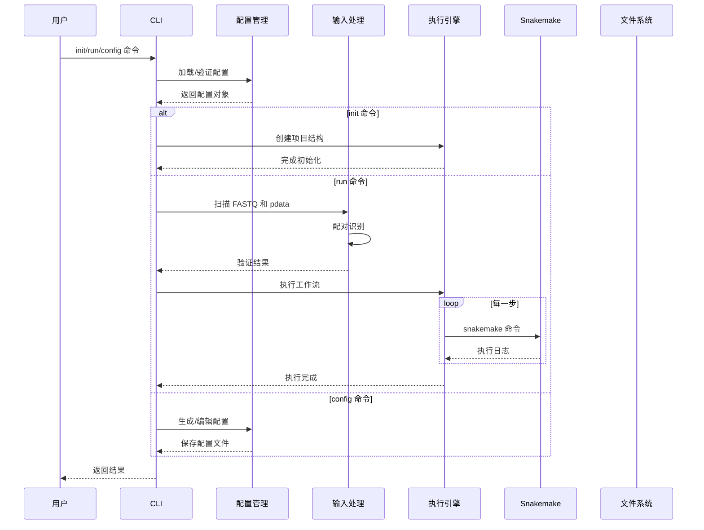
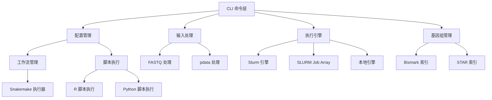

# 架构设计 (Architecture)

## 技术栈选型

| 层级 | 技术选择 | 版本 | 理由 |
|------|----------|------|------|
| **语言** | Go | 1.21+ | 单二进制、并发性能、开发效率 |
| **CLI 框架** | Cobra | v1.7 | 成熟的 CLI 库、命令嵌套 |
| **配置管理** | Viper | 1.19 | 多格式支持、环境变量 |
| **TUI 框架** | Bubble Tea | latest | 现代化 TUI、交互性强 |
| **日志库** | Logrus | 1.9 | 结构化日志、插件丰富 |
| **HTTP 客户端** | standard library | - | 轻量级 |

## 目录结构

```
xdxtools-go/
├── cmd/                          # CLI 命令入口
│   ├── root.go                   # 根命令
│   ├── init.go                   # init 子命令
│   ├── run.go                    # run 子命令
│   ├── config.go                 # config 子命令
│   ├── genome.go                 # genome 子命令
│   └── tui/                      # TUI 界面
│       ├── dashboard.go           # 仪表盘
│       ├── run_monitor.go        # 执行监控
│       └── config_wizard.go      # 配置向导
│
├── internal/                     # 内部包
│   ├── config/                   # 配置管理
│   │   ├── types.go              # 配置结构体
│   │   ├── loader.go            # 配置加载器
│   │   ├── validator.go          # 配置验证
│   │   ├── generator.go          # YAML 生成器
│   │   └── defaults.go           # 默认配置
│   │
│   ├── engine/                   # 执行引擎
│   │   ├── engine.go             # 引擎接口
│   │   ├── slurm.go             # Slurm 引擎
│   │   ├── local.go             # 本地引擎
│   │   └── detector.go          # 引擎检测
│   │
│   ├── workflow/                 # 工作流管理
│   │   ├── types.go              # 工作流类型
│   │   ├── snakemake.go         # Snakemake 执行器
│   │   ├── mode.go              # 模式处理
│   │   └── directory.go          # 目录创建
│   │
│   ├── input/                    # 输入处理
│   │   ├── fastq.go             # FASTQ 文件处理
│   │   ├── pdata.go             # pdata 表格解析
│   │   ├── pairing.go           # 配对识别算法
│   │   └── validator.go         # 输入验证
│   │
│   ├── genome/                   # 基因组管理
│   │   ├── builder.go           # 基因组构建器
│   │   ├── bismark.go           # Bismark 索引
│   │   ├── star.go              # STAR 索引
│   │   └── manager.go           # 基因组管理器
│   │
│   ├── script/                   # 脚本执行
│   │   ├── executor.go          # 脚本执行器
│   │   ├── r.go                 # R 脚本执行
│   │   ├── python.go            # Python 脚本执行
│   │   └── runner.go            # 统一运行器
│   │
│   ├── result/                   # 结果处理
│   │   ├── aggregator.go        # 结果聚合
│   │   ├── compressor.go        # 压缩器
│   │   └── reporter.go          # 报告生成
│   │
│   └── logger/                   # 日志系统
│       ├── logger.go            # 日志接口
│       ├── formatter.go         # 格式化器
│       └── level.go             # 日志级别
│
├── assets/                       # 资源文件
│   ├── config/                  # 配置模板
│   │   ├── default.yaml
│   │   ├── rrbs.yaml
│   │   ├── wgbs.yaml
│   │   ├── rnaseq.yaml
│   │   └── pdx.yaml
│   │
│   ├── snakefiles/              # Snakemake 文件
│   │   ├── BeaverBS_step*.snakemake
│   │   ├── BeaverPDX_step*.snakemake
│   │   ├── BeaverRNA_step*.snakemake
│   │   └── rules/
│   │
│   └── scripts/                 # R/Python 脚本
│       ├── R/
│       └── python/
│
├── pkg/                          # 公共包
│   ├── types/                   # 全局类型
│   │   ├── workflow.go
│   │   ├── engine.go
│   │   └── config.go
│   │
│   └── utils/                   # 工具函数
│       ├── file.go
│       ├── string.go
│       └── parallel.go
│
├── docs/                         # 文档
│   ├── requirements.md           # 需求文档
│   ├── architecture.md          # 架构设计
│   └── schema.sql               # 数据库设计（如需要）
│
├── go.mod
├── go.sum
└── main.go
```

## 核心数据流

### 数据流图



### 模块交互图



## 核心设计模式

### 1. 引擎模式 (Engine Pattern)

**目标**: 统一不同执行环境的调用方式

```go
type Engine interface {
    Execute(cmd []string) error
    GetName() EngineType
    GetStatus() Status
}

type SlurmEngine struct {
    Partition string
    Cores     int
}

func (e *SlurmEngine) Execute(cmd []string) error {
    // 生成 sbatch 脚本
    // 提交到 Slurm
}
```

### 2. 策略模式 (Strategy Pattern)

**目标**: 支持不同工作流模式的配置策略

```go
type ModeStrategy interface {
    GetWorkflowName() string
    GetStepCount() int
    ValidateConfig(*WorkflowConfig) error
}

type RRBSMode struct{}

func (m *RRBSMode) GetWorkflowName() string {
    return "BeaverBS"
}

func (m *RRBSMode) GetStepCount() int {
    return 3
}
```

### 3. 构建器模式 (Builder Pattern)

**目标**: 简化复杂对象创建

```go
type WorkflowBuilder struct {
    config *WorkflowConfig
}

func NewWorkflowBuilder() *WorkflowBuilder {
    return &WorkflowBuilder{
        config: &WorkflowConfig{},
    }
}

func (b *WorkflowBuilder) WithMode(mode Mode) *WorkflowBuilder {
    b.config.Mode = mode
    return b
}

func (b *WorkflowBuilder) Build() (*Workflow, error) {
    // 验证和构建
}
```

### 4. 工厂模式 (Factory Pattern)

**目标**: 动态创建引擎和脚本执行器

```go
func NewEngine(engineType EngineType, config map[string]interface{}) (Engine, error) {
    switch engineType {
    case EngineSlurm:
        return &SlurmEngine{...}, nil
    case EngineSlurmArray:
        return &SlurmArrayEngine{...}, nil
    case EngineLocal:
        return &LocalEngine{...}, nil
    }
}
```

## 数据模型

### WorkflowConfig

```go
type WorkflowConfig struct {
    // 基本信息
    Mode      Mode      `mapstructure:"mode"`
    Species1  string    `mapstructure:"species1"`
    Species2  string    `mapstructure:"species2,omitempty"`
    
    // FASTQ 配置
    Suffix1   string    `mapstructure:"suffix1"`
    Suffix2   string    `mapstructure:"suffix2"`
    
    // 输入文件
    Input     InputConfig `mapstructure:"input"`
    
    // 输出目录
    Output    OutputConfig `mapstructure:"output"`
    
    // 执行引擎
    Engine    EngineConfig `mapstructure:"engine"`
    
    // 参考基因组
    Reference ReferenceConfig `mapstructure:"reference"`
}
```

### Engine 接口

```go
type Engine interface {
    Execute(cmd []string) error
    GetName() EngineType
    GetStatus() Status
    Wait() error
    Kill() error
}

type Status struct {
    State     string
    JobID     string
    Progress  int
    Message   string
}
```

## 配置文件设计

### 默认配置 (assets/config/default.yaml)

```yaml
# 工作流模式
mode: "RRBS"  # RRBS/WGBS/RNASEQ/PDX

# 物种配置
species1: "human"
species2: null

# FASTQ 文件配置
suffix1: "_R1.fastq.gz"
suffix2: null  # 自动推导

# 输入文件
input:
  fastq_dir: "/data"
  pdata_file: null

# 输出目录
output:
  base_dir: "./results"
  workflow_dir: "/workflow"
  analysis_dir: "/analysis"

# 执行引擎
engine:
  type: "auto"  # auto/slurm/local
  slurm:
    partition: "amd_512"
    cores: 20
    memory: "100G"
  local:
    max_cores: 8

# 参考基因组
reference:
  genome: "hg19"
  genome_fasta:
    - "inst/pdx/homo_sapiens/hg19.fasta"
  genome_index:
    - "inst/pdx/homo_sapiens/"
  rnaseq_gtf: "inst/rnaseq/homo_sapiens/hg19.ensGene_sorted.gtf"

# 并行处理
parallel:
  workers: 4
```

## 错误处理

### 错误分类

```go
type ErrorType string

const (
    ErrorConfig    ErrorType = "CONFIG_ERROR"
    ErrorInput    ErrorType = "INPUT_ERROR"
    ErrorEngine   ErrorType = "ENGINE_ERROR"
    ErrorWorkflow ErrorType = "WORKFLOW_ERROR"
    ErrorScript   ErrorType = "SCRIPT_ERROR"
)

type XDXError struct {
    Type    ErrorType
    Code    int
    Message string
    Cause   error
}
```

### 错误恢复机制

```go
func (e *Engine) ExecuteWithRetry(cmd []string, maxRetries int) error {
    for i := 0; i < maxRetries; i++ {
        if err := e.Execute(cmd); err != nil {
            if isRetryable(err) && i < maxRetries-1 {
                log.Warn("执行失败，5秒后重试", "attempt", i+1)
                time.Sleep(5 * time.Second)
                continue
            }
            return err
        }
        return nil
    }
}
```

## 性能优化

### 并发处理

```go
// 并行处理多个样本
func ProcessSamples(samples []Sample, workers int) error {
    pool := make(chan struct{}, workers)
    results := make(chan error, len(samples))
    
    for _, sample := range samples {
        go func(s Sample) {
            pool <- struct{}{}
            results <- processSample(s)
            <-pool
        }(sample)
    }
    
    // 收集结果
}
```

### 资源管理

```go
// 资源池管理
type ResourcePool struct {
    cores    chan int
    memory   chan int64
}

func NewResourcePool(maxCores int) *ResourcePool {
    return &ResourcePool{
        cores: make(chan int, maxCores),
    }
}
```

## 测试策略

### 单元测试
- 配置加载和验证
- FASTQ 配对识别算法
- 引擎接口实现
- 脚本执行器

### 集成测试
- 完整的 CLI 命令流程
- Snakemake 集成
- TUI 界面交互

### 模拟测试
- 引擎执行（mock）
- 文件系统操作
- 网络请求

## 部署方案

### 单二进制
```bash
# 构建
go build -o xdxtools -ldflags="-s -w"

# 大小检查
ls -lh xdxtools  # < 20MB
```

### 包管理
```bash
# .deb 包
goreleaser build --rm-dist --snapshot

# 自动上传到 GitHub Releases
```

## 监控和日志

### 结构化日志

```go
log := logrus.New()
log.WithFields(logrus.Fields{
    "workflow_id": workflow.ID,
    "step":       step,
    "sample":     sample.Name,
}).Info("开始执行步骤")
```

### 指标收集

```go
type Metrics struct {
    StartTime    time.Time
    EndTime      time.Time
    Samples      int
    SuccessCount int
    ErrorCount   int
}
```

## 安全考虑

- 配置文件权限检查
- 脚本执行权限控制
- 临时文件清理
- 敏感信息过滤

## 扩展性

### 插件系统

```go
type Plugin interface {
    Name() string
    Init() error
    Execute() error
}
```

### 新引擎支持

```go
type NewEngine struct{}

func (e *NewEngine) Execute(cmd []string) error {
    // 实现新引擎
}

func init() {
    RegisterEngine("new_engine", &NewEngine{})
}
```
