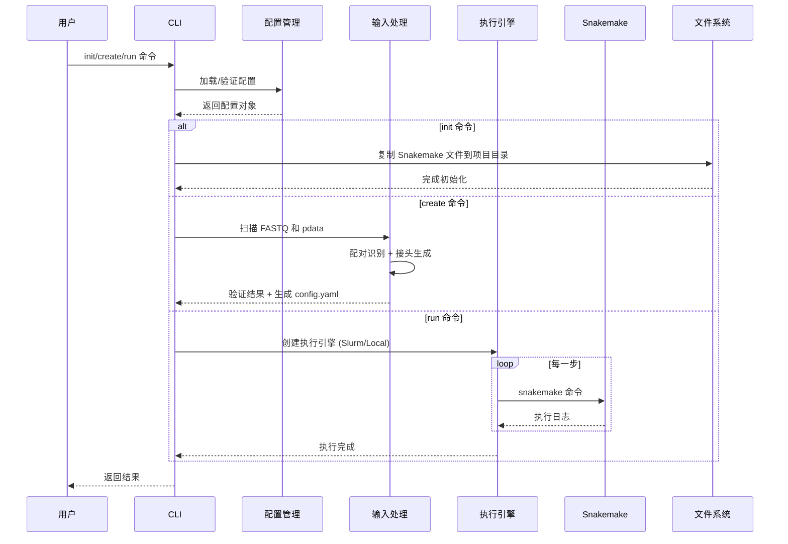
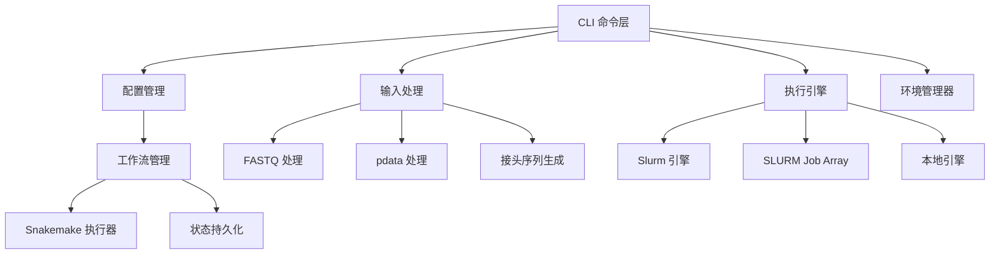

# 架构设计 (Architecture)

## 技术栈选型

| 层级 | 技术选择 | 版本 | 理由 |
|------|----------|------|------|
| **语言** | Go | 1.21+ | 单二进制、并发性能、开发效率 |
| **CLI 框架** | Cobra | v1.7 | 成熟的 CLI 库、命令嵌套 |
| **配置管理** | Viper | 1.19 | 多格式支持、环境变量 |
| **日志库** | Logrus | 1.9 | 结构化日志、插件丰富 |

## 目录结构

```
xdxtools/
├── cmd/                          # CLI 命令入口
│   ├── root.go                   # 根命令
│   ├── init.go                   # init 子命令
│   ├── create.go                 # create 子命令
│   ├── run.go                    # run 子命令
│   ├── config.go                 # config 子命令
│   ├── status.go                 # status 子命令
│
├── internal/                     # 内部包
│   ├── config/                   # 配置管理
│   │   ├── config.go             # 核心配置结构体
│   │   ├── loader.go             # 配置加载器
│   │   ├── validator.go          # 配置验证
│   │   ├── generator.go          # YAML 生成器
│   │   └── defaults.go           # 默认配置
│   │
│   ├── engine/                   # 执行引擎
│   │   ├── engine.go             # 引擎接口定义
│   │   ├── types.go              # 引擎类型常量
│   │   ├── factory.go            # 工厂函数
│   │   ├── slurm.go              # Slurm 引擎
│   │   ├── slurm_array.go        # SLURM Job Array 引擎
│   │   ├── local.go              # 本地引擎
│   │   └── system.go             # 系统环境检测
│   │
│   ├── workflow/                 # 工作流管理
│   │   ├── types.go              # 工作流类型
│   │   ├── manager.go            # 工作流管理器
│   │   ├── snakemake.go          # Snakemake 执行器
│   │   └── state.go              # 状态持久化
│   │
│   ├── input/                    # 输入处理
│   │   ├── types.go              # 输入数据类型
│   │   ├── fastq.go              # FASTQ 文件扫描与配对
│   │   ├── pdata.go              # pdata 表格解析 (CSV/Excel)
│   │   ├── adapter.go            # 接头序列生成
│   │   └── validator.go          # 输入验证
│   │
│   ├── assets/                   # 嵌入资源管理
│   │   └── assets.go             # embed 包封装
│   │
│   ├── enva/                     # 环境管理器集成
│   │   └── enva.go               # enva 子进程调用封装
│   │
│   ├── logger/                   # 日志系统
│   │   └── logger.go             # 结构化日志接口
│   │
│   ├── script/                   # 脚本执行
│   │   └── executor.go           # 脚本执行器
│   │
├── inst/                         # 嵌入资源文件 (embed 源目录)
│   ├── snakefiles/               # Snakemake 主工作流文件
│   │   ├── BeaverBS_step*.snakemake
│   │   ├── BeaverPDX_step*.snakemake
│   │   └── BeaverRNA_step*.snakemake
│   ├── root_rules/               # 全局 Snakemake 规则
│   ├── rootless_rules/           # 本地 Snakemake 规则
│   ├── Rscripts/                 # R/Python 分析脚本
│   └── envs/                     # Conda 环境定义
│
├── pkg/                          # 公共包
│   ├── types/                    # 全局类型定义
│   │   └── types.go
│   └── utils/                    # 工具函数
│       └── utils.go
│
├── testdata/                     # 测试数据
│   ├── fastq/                    # 示例 FASTQ 文件
│   ├── pdata/                    # 示例表型数据 (CSV/Excel)
│   ├── configs/                  # 示例配置文件
│   └── e2e/                      # 端到端测试数据
│
├── docs/                         # 文档
│   ├── active_context.md         # ⭐ 系统当前状态 (保持更新)
│   ├── architecture.md           # 架构设计 (本文件)
│   ├── requirements.md           # 需求文档
│   ├── build.md                  # 构建指南
│   ├── installation.md           # 安装指南
│   ├── project-overview.md       # 项目概览
│   ├── submodules-build-guide.md # 子模块构建指南
│   └── archive/                  # 历史记录 (只读)
│
├── embed.go                      # Go embed 指令
├── main.go
├── go.mod
└── go.sum
```

## 核心数据流

### 数据流图



### 模块交互图



## 核心设计模式

### 1. 引擎工厂模式 (Factory Pattern)

**目标**: 动态创建执行引擎，统一接口

```go
// internal/engine/factory.go
func CreateEngineFromConfig(cfg *config.XDXToolsConfig) (Engine, error) {
    switch cfg.Engine.Type {
    case EngineSlurm:
        return &SlurmEngine{...}, nil
    case EngineSlurmArray:
        return &SlurmArrayEngine{...}, nil
    case EngineLocal:
        return &LocalEngine{...}, nil
    }
}
```

### 2. 引擎接口模式 (Engine Pattern)

**目标**: 统一不同执行环境的调用方式

```go
// internal/engine/engine.go
type Engine interface {
    Execute(cmd []string) error
    ExecuteWithOutput(cmd []string) (string, error)
    GetName() EngineType
    GetStatus() *Status
    Wait() error
    Kill() error
    SetLogDir(dir string) error
}
```

### 3. 策略模式 (Strategy Pattern)

**目标**: 支持不同工作流模式 (RRBS/WGBS/RNASEQ/PDX)

- RRBS/WGBS/BSSEQ → `BeaverBS` (3 步)
- RNASEQ → `BeaverRNA` (2 步)
- PDX → `BeaverPDX` / `BeaverRNASEQPDX` (species2 非空时自动启用)

### 4. 并行化策略

- **< 5 样本**: 顺序执行
- **≥ 5 样本**: SLURM Job Array 或本地工作池
- Step 2/3: 单样本模式 (`--config "SIDs=[sample]"`)
- Step 1 及检查步骤: 全样本模式

## 数据模型

### 核心配置类型

```go
// internal/config/config.go
type XDXToolsConfig struct {
    Workflow  WorkflowConfig
    Input     InputConfig
    Output    OutputConfig
    Reference ReferenceConfig
    Engine    EngineConfig
}

type WorkflowConfig struct {
    Mode    string        // RRBS, WGBS, RNASEQ
    Species SpeciesConfig
    Adapters AdapterConfig
    Samples []SampleConfig
}
```

### Engine 接口与状态

```go
type Status struct {
    State    string  // PENDING/RUNNING/COMPLETED/FAILED/KILLED
    JobID    string
    Progress int
    Message  string
}
```

## 测试策略

### 单元测试
- 配置加载和验证 (`internal/config/`)
- FASTQ 配对识别算法 (`internal/input/`)
- 引擎接口实现 (`internal/engine/`)
- 接头序列生成 (`internal/input/adapter.go`)

### 集成测试
- 完整的 CLI 命令流程
- Snakemake 集成

### 测试数据
集中在 `testdata/` 目录：
- `fastq/` - 示例 FASTQ 文件
- `pdata/` - 表型数据 (CSV/Excel)
- `configs/` - 示例配置
- `e2e/` - 端到端测试数据

## 部署方案

```bash
# 开发构建
go build -o xdxtools

# 静态构建 (发行版)
CGO_ENABLED=0 go build -ldflags="-s -w" -o target/release/xdxtools-linux-amd64
```
