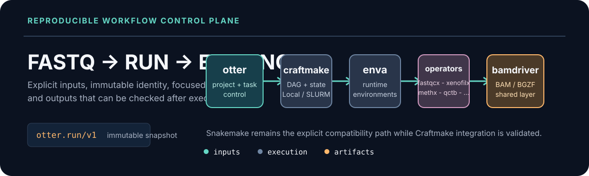

# Otter architecture

Otter is the workflow control plane. It validates user inputs, resolves project intent into an immutable run snapshot, selects an executor, tracks tasks, and verifies published artifacts.

<p align="center">
  
</p>

## Component boundaries

```text
otter → craftmake → enva → operators → bamdriver
```

| Layer | Owns | Does not own |
| --- | --- | --- |
| `otter` | Project/configuration, input validation, executor routing, task control, embedded compatibility assets | Domain algorithms or low-level BAM I/O |
| `craftmake` | Workflow compilation, DAG scheduling, Local/SLURM execution, SQLite state, recovery, reports | Otter project creation or domain-specific sample semantics |
| `enva` | Rattler-first environment lifecycle and explicit package-manager compatibility | Workflow orchestration or scientific outputs |
| Operators | FASTQ QC, PDX classification, paired BAM filtering, matrices, splicing, methylation, QC reports | Global project lifecycle |
| `bamdriver` | Shared pure-Go BAM/BGZF, sorting, indexing, FASTA, and alignment helpers | End-user workflow policy |

## Two execution paths

### Legacy-compatible path

`otter init` and `otter create` generate the established project layout and `otter.yaml`. Existing production assets run through the explicit Snakemake compatibility executor:

```bash
otter run \
  --config my_project/userspace/<jobid>/config/otter.yaml \
  --executor snakemake \
  --engine slurm
```

This path remains supported for established projects. It is not a Craftmake run.

### Canonical v1 path

The canonical path separates project intent from execution:

```text
project.yaml + samples.tsv + references.lock.yaml
                         ↓
                 typed resolver
                         ↓
              runs/<run-id>/run.yaml
                         ↓
             Craftmake or Snakemake adapter
```

`run.yaml` freezes executor, backend, site, workflow scenario, toolchain, references, inputs, resources, workflow assets, and digests. Craftmake consumes this snapshot and rejects runtime changes that would invalidate its identity.

## Configuration and state boundaries

- Project files describe desired analysis intent and defaults.
- The resolver expands paths and records the source of every effective choice.
- A run snapshot is immutable after publication.
- Resume reuses the source run identity for recovery and creates a new execution record where required by the executor.
- Artifact manifests are written under the run's `results/` boundary and bind outputs to the snapshot digest.
- Controller logs and SQLite state are operational evidence; they do not replace scientific comparison.

## Executor, backend, and toolchain are orthogonal

```yaml
execution:
  executor: craftmake
  backend: auto
  site: auto
workflow:
  scenario: rnaseq
  toolchain: modern
```

- `executor`: `craftmake` or explicit `snakemake` compatibility.
- `backend`: `local`, `slurm`, or `auto` during resolution.
- `toolchain`: `modern` or `legacy-equivalent` where a valid comparison exists.
- `scenario`: `rrbs`, `wgbs`, `rnaseq`, `bs-pdx`, or `rna-pdx`.

A Craftmake failure never silently falls back to Snakemake. A partial SLURM environment fails closed instead of silently selecting Local for production work.

## Evidence boundary

Gate 6 accepted bounded executor comparison, corrected classification controls, and Methx/Methrix parity. It did not establish production-scale throughput, the fresh seven-input legacy-equivalent matrix, complete WGBS qualification, or universal Snakemake replacement. Those statements remain outside the release claim until separately evidenced.

## Repository boundary

The root repository owns `cmd/`, `internal/`, `pkg/`, `inst/`, `testdata/`, `docs/`, and `skills/`. Every component directory is an independent repository recorded by a parent gitlink. Changes to a submodule must be reviewed and published in that submodule before the parent pointer is updated.

## Related documents

- [Configuration contract](configuration.md)
- [Execution contract](execution-contract.md)
- [Reference registry](reference-registry.md)
- [Site and backend profiles](site-profiles.md)
- [Workflow catalog](workflow-catalog.md)
- [Craftmake adoption](migration/craftmake-adoption.md)
