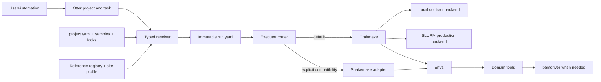

# Otter 架构设计

> 更新日期：2026-07-26。本文同时区分当前实现和已冻结的目标契约。

## 架构目标

```text
otter → craftmake → enva → 算子 → bamdriver
```

Otter 管理项目意图、配置解析、run snapshot 和顶层任务；Craftmake 编译 DAG 并控制 Local/SLURM；Enva 提供可复现环境；领域算子生成科学产物；BAM 低层能力由 `bamdriver` 复用。

## 当前状态与目标状态

| 领域 | 当前实现 | 目标契约 |
|---|---|---|
| 默认 executor | Craftmake 默认；Snakemake 仅显式 compatibility executor | Craftmake 默认；Snakemake 仅显式兼容 |
| config | `OtterConfig` 和多种 legacy key | canonical `project.yaml` + immutable `run.yaml` |
| Craftmake 输入 | adapter 直接兼容多种 Otter config | 只解析一个 resolved `run.yaml` |
| backend | Otter `internal/engine` 提供 local/SLURM | Craftmake 管理 Local/SLURM；`backend=auto` fail closed |
| workflows | RRBS/WGBS/RNA/PDX Snakemake assets | RRBS/WGBS/RNA-seq/BS-PDX/RNA-PDX 双轨 catalog |
| reference | 配置中的路径/数组 | shared registry + project lock + run override |
| 验证 | 本地测试与零散 smoke | Local contract-only；真实流程统一 sbatch |

Craftmake 成为默认 executor 不表示 Snakemake 可以移除；退场必须通过五场景 parity、恢复和 benchmark 门禁。

## 目标控制流



## 配置和运行边界

项目文件：

- `project.yaml`：用户意图与默认 executor/backend/toolchain；
- `samples.tsv`：版本化样本清单；
- `references.lock.yaml`：项目默认 genome release/manifest；
- `project.lock.yaml`：项目内 workflow/rules/environment/schema digest。

Otter 合并 CLI、site/profile detection 和项目默认，生成 `runs/<run_id>/run.yaml`。该 snapshot 固化绝对输入/reference 路径、所有 digest、最终 executor/backend/resource 及其来源。Craftmake 和 Snakemake adapter 都消费 snapshot，不能再次解析项目/legacy config。

Run ID：`run-YYYYMMDDTHHMMSSZ-abcdef`，UTC 秒级时间戳加 6 位安全随机小写英文后缀。resume 复用原 run ID；改变输入、reference、executor 或 toolchain 必须创建新 run。

详细契约见 [配置](configuration.md)、[项目目录](project-layout.md) 和 [执行协议](execution-contract.md)。

## Executor、Backend 与 Toolchain

三个维度正交：

```yaml
execution:
  executor: craftmake
  backend: auto
  site: auto
workflow:
  toolchain: modern
```

- executor：`craftmake | snakemake`；Snakemake 不作为失败 fallback。
- backend：`auto | local | slurm`；auto 在完整 SLURM 条件下选 slurm，无 SLURM 时选 Local，部分可用时 fail closed。
- toolchain：`modern | legacy-equivalent`；legacy-only extensions 单列。

Local 只验证 schema、DAG、CLI、fake backend 和状态机。所有真实科学流程、cancel/resume、等价性和性能 benchmark 在 sbatch 集群运行。

## Reference 架构

大型 genome 使用 `$OTTER_REFERENCE_ROOT/genomes/<id>/<release>/` registry。`reference.yaml`、manifest 和 checksums 描述 FASTA、annotation、index、构建 provenance 与兼容场景。项目 lock 固定 ID/release/manifest digest，site resolver 解析实际 mount。

单次 run 可以覆盖 genome；override 只进入新 snapshot，不修改项目默认。显式 `otter reference promote <run_id>` 经 preview/confirm 后才能提升默认。详见 [Reference Registry](reference-registry.md)。

## Workflow 与科学产物

五个场景是 `rrbs`、`wgbs`、`rnaseq`、`bs-pdx` 和 `rna-pdx`。每场景定义统一 phase/artifact contract，Craftmake 与 Snakemake 使用相同结果布局。执行器比较固定 toolchain；工具比较固定 executor。

产品更名不改变 FastQC/MultiQC、FASTQ/BAM、Bismark、HTSeq、Methrix/HDF5、rMATS 等标准和科学语义。场景和工具映射见 [Workflow Catalog](workflow-catalog.md)。

## 仓库边界

父仓根目录包含 `cmd/`、`internal/`、`pkg/`、`inst/`、`testdata/` 和 `docs/`。`craftmake/`、`enva/` 及领域算子是独立 git submodule；父仓文档变更不修改子仓内容。

## 迁移门禁

迁移按 Gate 0–7 推进：契约冻结、typed resolver、执行协议、site/backend、reference registry、五场景 workflow、sbatch parity/benchmark、默认稳定与退场评估。完整路线见 [Craftmake Adoption](migration/craftmake-adoption.md)，验证政策见 [Benchmark Plan](benchmark-plan.md)。
