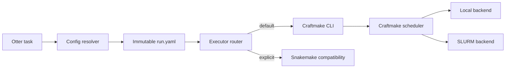

# Otter–Craftmake 执行协议

> 状态：目标协议。当前 Craftmake CLI 已具备相关命令，但输出和 `run.yaml` 单输入边界仍需按本协议实现。

## 职责边界



- Otter 管理项目、解析、顶层 task、run directory 和 executor process。
- Craftmake 管理 DAG、submission、task、cache、metrics、Local/SLURM backend 和 executor state。
- Snakemake adapter 只作为显式兼容路径，消费同一 `run.yaml`。
- Otter 不在 Craftmake 路径中重复实现 scheduler 或 SLURM job array。

## Run ID

格式：`run-YYYYMMDDTHHMMSSZ-abcdef`。时间为 UTC，后缀为 6 位安全随机小写英文。ID 同时写入 `run.yaml`、manifest、Otter task 和 Craftmake state。resume 复用原 ID。

## CLI

目标机器接口：

```bash
craftmake validate --config <run.yaml> --format json
craftmake plan     --config <run.yaml> --format json
craftmake run      --config <run.yaml> --format json
craftmake resume   --config <run.yaml> --run-id <id> --format json
craftmake status   --state <state.sqlite> --run-id <id> --format json
craftmake cancel   --state <state.sqlite> --run-id <id> --format json
craftmake report   --state <state.sqlite> --run-id <id> --format json
```

Craftmake 只解析一个 `run.yaml`；不读取 `project.yaml`、samples、reference registry、site profile 或 legacy fields。

## JSON envelope

stdout 只输出版本化 envelope：

```json
{
  "protocol_version": "otter.craftmake/v1",
  "command": "run",
  "ok": true,
  "run_id": "run-20260726T013245Z-kxqjrm",
  "state_path": ".../state/craftmake/state.sqlite",
  "controller_log": ".../logs/craftmake/controller.jsonl",
  "data": {}
}
```

- stderr 只包含人类诊断，不作为 Otter 状态解析源。
- 长期事件写 JSONL，至少包含 timestamp、run/task/submission/backend job ID、status、reason 和 metrics references。
- 协议版本不兼容时在执行前失败。

## 退出码

| 类别 | 语义 |
|---|---|
| success | 命令成功 |
| usage | CLI 参数错误 |
| config | run schema、digest 或 immutable invariant 错误 |
| state | SQLite/run state 错误 |
| backend | Local/SLURM 初始化或控制面错误 |
| task | 科学任务失败或被依赖阻断 |
| internal | 未分类内部错误 |

具体数值沿用 Craftmake 已有固定退出码，文档实施时不得重排已发布值。

## 状态关联

```text
Otter task ID
  -> executor run ID
      -> submission ID
          -> task/attempt ID
              -> SLURM job/step ID
```

这些 ID 必须可从 Otter task record、Craftmake SQLite、controller JSONL 和 manifest 双向追溯。

## Cancel、signal 与 resume

- Otter 将 SIGINT/SIGTERM 转发给 Craftmake。
- Craftmake 对 SLURM 调用 `scancel`，对 Local 终止受管 process group。
- cancel 必须记录请求、后端确认和最终状态。
- resume 使用原 `run.yaml` 和 run ID；任何 config/reference/workflow digest 不一致都拒绝。
- 需要改变 reference、executor、toolchain、samples 或资源解析时创建新 run，并用 lineage 字段关联旧 run。

## 默认选择与来源

- executor 默认 Craftmake；Snakemake 只能显式选择。
- backend 默认 auto；SLURM 不完整时 fail closed。
- executor/backend/toolchain/site 的值和来源（default/project/CLI/detection/profile）都写入 `run.yaml` 与 manifest。
- 禁止 Craftmake 失败后自动回退 Snakemake。
