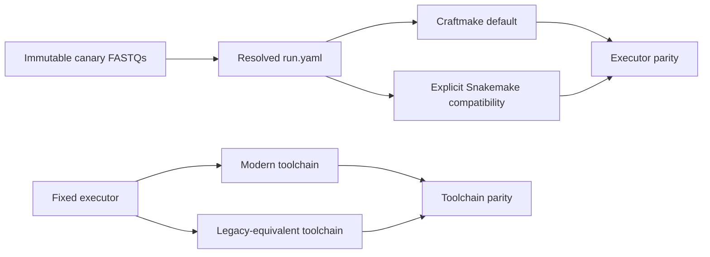

# Gate 6 Canary Matrix

This matrix freezes the production-grade canary inputs and comparison cells for the active non-WGBS scenarios. It applies only after the paired source FASTQs and selected reference release pass compute-node visibility and checksum verification.

> **Current report:** See [Gate 6 新旧工具链比较报告](gate6-toolchain-comparison-report.md) for the 2026-08-26 consolidated evidence, including the BS-PDX `SRR36187610` Methx benchmark and formal `step3-check` acceptance. The current evidence is bounded canary and implementation acceptance; it does not close the representative, scale, WGBS, or full fresh modern-vs-legacy matrix gates.

## Consolidated Status (2026-08-26)

| Evidence area | Status | Evidence |
|---|---|---|
| Modern Craftmake production path | Passed for completed scenario phases | Real Otter immutable snapshots, Craftmake controllers, Slurm accounting, and artifact verification are retained per project |
| RRBS executor parity | Accepted bounded evidence | Historical clean Craftmake/Snakemake pair, semantic comparison, and recovery evidence |
| RNA-seq executor parity | Accepted bounded evidence | r31 fresh Craftmake/Snakemake pair completed all phases with artifact verify/compare |
| PDX executor parity | Accepted bounded scheduler evidence | BS-PDX and RNA-PDX real Slurm paired `step2-check` repeats; performance interpretation remains descriptive |
| BS-PDX Methx annotation | Passed bounded performance acceptance | 7,290,833 CpGs, v2 binary index, 5/5 outputs, details rows 7,290,834, formal checker controller `41687475` exit 0 |
| Fresh seven-input modern-vs-legacy scientific parity | Open | Requires fresh paired immutable snapshots and complete artifact/semantic comparisons |
| Representative and scale gates | Open | `20 samples × 3 repeats` and scheduler-pressure evidence are not complete |
| WGBS | Deferred | `SRR6373947` needs primary-reference requalification and acquisition provenance |

The `modern` and `legacy-equivalent` labels describe workflow/tool mappings. Rust Bismark 3.1.0 and Bowtie2 2.5.4 remain shared pinned runtime dependencies and are not a Perl-versus-Rust comparison axis.

## Independent Comparison Axes

- Executor parity fixes the complete toolchain, parameters, reference, resolved resources, and immutable canary pair; only `execution.executor` differs.
- Toolchain parity fixes the executor and the same input/reference/parameters; only `workflow.toolchain` differs.
- Rust Bismark 3.1.0 and Bowtie2 2.5.4 are shared pinned runtime dependencies, not a comparison axis. No Perl-versus-Rust Bismark cell is permitted.

## Canary Inputs and Production Reacquisition Status

The historical canary sources must not be treated as available production inputs. The expanded Paracloud storage audit completed on 2026-08-12 did not recover the five registered raw SRA/FASTQ pairs below. Every candidate is therefore `missing_reacquire_for_production` until a new immutable acquisition record verifies the archive and decoded FASTQ files. `SRR8397559` was confirmed by NCBI/ENA metadata to be `Mus musculus` (RNA-Seq, PRJNA513077), so it must not be used as a human `hg38` RNA input; its frozen human role was incorrect.

| Scenario | Accession | Reference roles | Decode status (2026-08-14) |
|---|---|---|---|
| RRBS | `SRR31480456` | primary `hg19@GRCh37.p13-gencode-v19` | standalone decode + verifier complete; acquisition manifest pending |
| WGBS | `SRR6373947` | primary reference selected during requalification | deferred; candidate still open |
| RNA-seq | `SRR8397559` | **mouse; invalid as human RNA input** | must not be acquired for human RNA |
| RNA-seq (replacement) | `SRR1039508` | primary `hg38@GRCh38-gencode-v44` | standalone decode + verifier complete; acquisition manifest pending |
| BS-PDX | `SRR23802966` | graft `hg38@GRCh38-gencode-v44`; host `mm10@GRCm38-gencode-M25` | standalone decode + verifier complete; acquisition manifest pending |
| RNA-PDX | `SRR30880970` | graft `hg38@GRCh38-gencode-v44`; host `mm10@GRCm38-gencode-M25` | standalone decode + verifier complete; acquisition manifest pending |

A production acquisition uses `otter.sra-acquisition/v1`. Its immutable, create-only manifest records the SRA archive's provider MD5, SHA-256, size, decoded paired FASTQ paths/SHA-256/sizes/record count, role-specific reference identity, and exact `sra-tools` command. The manifest is valid only when archive and FASTQ files are regular, nonempty files that match all declared identities. The first post-acquisition immutable `run.yaml` must consume the declared FASTQ files; it must not reopen or modify the acquisition manifest.

### Next candidates (scheduled, decode + verifier complete 2026-08-15)

Three new candidates were processed through the isolated create-only path on 2026-08-15. All three decodes and independent compute-node verifiers completed with `0:0`; final `otter.sra-acquisition/v1` provenance records are still pending.

| Intended scenario | Candidate | Source project | Decode job | Verifier job | Paired records (verified) | R1 / R2 SHA-256 (verified) |
|---|---|---|---|---|---|---|
| Human RNA-seq | `SRR018258` | PRJNA39289 (Melanoma Cell Transcriptome) | `41456542` (0:0, 3m47s) | `41456594` (0:0, 2m15s) | 15,314,364 | `753d3c7e…71fc` / `602f3883…bfda` |
| Mouse RNA-seq | `SRR037954` | PRJNA124751 (transcript assembly) | `41456544` (0:0, 7m15s) | `41456595` (0:0, 3m21s) | 23,060,060 | `2c016df2…62a0` / `4c1c131d…c91cd` |
| Mouse RRBS | `SRR10025242` | PRJNA562525 (mitochondrial toxicant methylation) | `41456543` (0:0, 3m10s) | `41456596` (0:0, 1m25s) | 11,935,038 | `b5a565e4…f5e5` / `795a0b49…f683d` |

Archive identities were SDL-verified before upload and rechecked by each decode task on the compute node. Each candidate must still receive a final `otter.sra-acquisition/v1` record binding archive and FASTQ identity to its scenario reference roles before it may feed an immutable production `run.yaml`. WGBS `SRR6373947` remains deferred and requires a separately scoped primary-reference selection before any acquisition.

The previously accepted BS-PDX and RNA-PDX Xenofilx replays remain executor evidence only. They do not satisfy this source-input gate and must not be extrapolated to full production qualification.

## Seven-Input Craftmake Toolchain Cells (2026-08-15)

The seven decoded inputs above form the next toolchain-comparison corpus. Before submission, each accepted input must be represented by an immutable `otter.sra-acquisition/v1` record and a fresh Otter-resolved `otter.run/v1` snapshot. Otter owns project/sample/reference/provenance validation and snapshot generation; Craftmake, reached through `otter run --executor craftmake`, is the only workflow planner, Slurm submitter, resume controller, status/log provider, and report generator. Handwritten production `run.yaml` and direct workflow `sbatch` submission are prohibited.

The shared phase envelope is raw `fastqcx` plus FastQC/SeqKit oracle QC, common pinned Trim Galore, and trimmed `fastqcx` plus FastQC/SeqKit oracle QC. Trim Galore is fixed across both toolchains. Downstream comparison is assay-specific: two RRBS inputs, three RNA-seq inputs, one BS-PDX input, and one RNA-PDX input. `pairbam`/`bamdriver` applies only to BS (RRBS/WGBS) and BS-PDX paired-BAM phases; RNA-seq and RNA-PDX must not schedule it. WGBS is not part of this corpus. Snakemake is excluded from these main toolchain cells and remains only for minimal compatibility/recovery closeout.

### Step1 (QC + Trim Galore) execution status (2026-08-15)

All seven inputs now have create-only `otter.sra-acquisition/v1` records and fresh Otter-resolved `otter.run/v1` snapshots (per-project `data/<sample>_R1/_R2.fastq.gz` symlinks to the acquisition-declared `decoded/R1/R2.fastq.gz`; frozen digests match the acquisition manifests). The comparison runtime is isolated at `otter-gate6/toolchain-comparison-20260815T070000Z/runtime` with a static Otter, a static current-session Craftmake, and the current workflow catalog. The catalog step1 YAML files run six per-sample tasks: modern `fastqc_before`/`fastqc_after` (fastqcx), shared `trim_reads` (Trim Galore), and legacy `fastqc_before`/`fastqc_after` (FastQC 0.12.1) + `seqkit_statistics` (SeqKit 2.13.0) via `enva run otter-core --`.

Step1 was submitted through `otter run --foreground --executor craftmake --phase step1` per project (Slurm controller jobs). Completed with `status: succeeded`:

| Project | Scenario | Controller | Notes |
|---|---|---|---|
| `mouse-rrbs-SRR10025242` | RRBS | `41457428` | full QC/trim/seqkit outputs |
| `human-rnaseq-SRR1039508` | RNA-seq | `41457465` | full QC/trim/seqkit outputs |
| `mouse-rnaseq-SRR037954` | RNA-seq | `41457467` | full QC/trim/seqkit outputs |
| `human-rrbs-SRR31480456` | RRBS | `41457466` | full QC/trim/seqkit outputs |

`human-rnaseq-SRR018258` (`41457464`), `rna-pdx-SRR30880970` (`41457468`), and `bs-pdx-SRR23802966` (`41457463`) controllers were still running as of the last check; their step1 runs are slowed by shared-node CPU contention on the FastQC raw-read task. BS-PDX uses a 12-hour step1 phase envelope for its 57 GB input. `rna-pdx-SRR30880970` subsequently completed with `status: succeeded` (controller exit 0 at 11:03:47Z). `human-rnaseq-SRR018258` required recovery: its raw FastQC attempt (`41457483`) hit the 2-hour step1 wall limit (`TIMEOUT`) under extreme node contention and was marked failed; the foreground resume controller `41457709` (`otter run --foreground --resume`) re-attempted the task, which succeeded on a fresh node in 71.6 s (job `41457710`), completing all six step1 outputs. The phase-run status query still shows the original failed attempt (`failed: 1, succeeded: 5`) while the resume run `8c8a455e…` finished `succeeded`; this is recorded as a documented recovery incident. After all step1 controllers complete, the workflow-specific downstream phases (step2 alignment/count/splicing, step3 methylation for BS workflows) and the modern/legacy toolchain comparison can proceed.

## Canary Execution Cells

For each scenario, submit the following in order:

1. Craftmake default executor with `modern` toolchain.
2. Explicit Snakemake compatibility executor with the same `modern` toolchain and resolved resources; compare this cell to cell 1 as executor parity.
3. Craftmake default executor with `legacy-equivalent` toolchain only after cells 1 and 2 pass; compare to cell 1 as toolchain parity.
4. Run the explicit Snakemake legacy-equivalent cell only when it is required to diagnose a difference; it is not used to attribute executor behavior.

Each cell uses a distinct immutable `run.yaml`, because executor/toolchain are immutable snapshot fields. Inputs, references, site profile, resource provenance, and the pinned Rust Bismark/Bowtie2 runtime must match across an executor pair.

## RRBS r18 Recovery and Semantic Evidence Note (2026-08-06)

Accepted immutable release: `gate6-20260806T050000Z-aca58fb-8bb5d64-slurm-timeout-submit-retry-r18`. Fresh recovery snapshots were `run-20260806T060001Z-recovc`, `run-20260806T060003Z-recovt`, `run-20260806T070001Z-pubrty`, and `run-20260806T071001Z-failrt`. Real Slurm controller interruption/resume passed for both executors: Snakemake controller `41186521` was cancelled and resumed by `41186530`/child `41186531`; Craftmake controller `41186558` was cancelled while children were reconciled, then resumed successfully by `41186569`. Craftmake publication interruption/retry and a classified failed publish-task manual retry also passed. RRBS Methrix semantic parity and normalized QC table equality passed. Immutable evidence is retained under the r18 RRBS recovery, publication-retry, and failed-task-retry roots.

## RRBS r16b Clean Executor-Parity Evidence (2026-08-06)

The clean RRBS executor-parity pair completed on Paracloud under accepted release `gate6-20260805T102500Z-aca58fb-8bb5d64-snakemake-projection-reuse-r16`. Craftmake and explicit Snakemake immutable snapshots both published read-only artifact manifests; `otter artifact verify` passed for both and `otter artifact compare` passed for Methrix HDF5, Bismark summary HTML, and QC XLSX. The r17b reconciliation smoke and r18 real controller interruption/resume, publication retry, and failed-task retry evidence also passed. RRBS Methrix semantic parity and normalized QC table equality passed under r18 evidence. The remaining scenarios still require paired canaries. WGBS remains explicitly deferred.

## Promotion Gates

| Gate | Required evidence | Blocks promotion when |
|---|---|---|
| input | immutable `otter.sra-acquisition/v1` manifest, source/output checksums, gzip/pair audit, compute visibility | any identity field is missing or mismatched |
| execution | controller JSONL, SQLite state, task result files, Slurm job/step IDs, `sacct` accounting | an unclassified failed/cancelled attempt exists |
| artifact | `otter artifact verify` for every completed run | manifest/checksum/structural verification fails |
| parity | `otter artifact compare` plus scenario semantic report | exact or structural comparison fails; scientific difference lacks root cause and time-bounded waiver |
| recovery | controlled cancel, failed task, controller interruption/resume, publish retry evidence on Slurm | cache/recovery or create-only publication behavior is not demonstrated |
| representative | 20 samples and three repeated runs per approved comparison cell | any prior gate is open |
| scale | production throughput and scheduler-pressure evidence | representative median/range or incident review is incomplete |

WGBS `SRR6373947` requires a separately scoped primary-reference selection during requalification. It remains blocked from production submission until that selection and its immutable `otter.sra-acquisition/v1` evidence are accepted.
