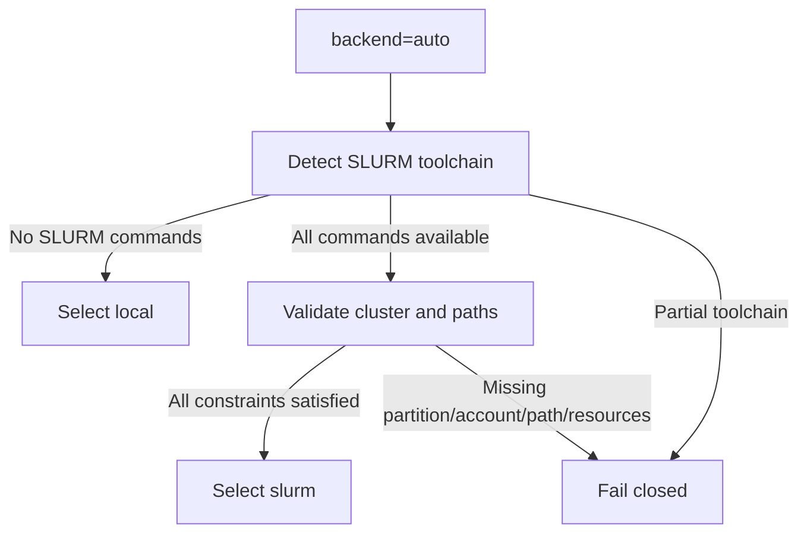

# Otter Site 与 Backend 探测契约

> 状态：目标契约。用于把可移植项目配置解析为特定集群上的不可变 run snapshot。

## 默认值

```yaml
execution:
  executor: craftmake
  backend: auto
  site: auto
```

## Backend auto 状态机



成套 SLURM 命令至少包括 `sbatch`、`squeue`、`sacct` 和 `scancel`。探测还必须覆盖：

- cluster name；
- partition、account、QOS；
- CPU、memory、time、submit/job-array limits；
- shared project/reference paths；
- scratch root 和 cleanup policy；
- compute node 对 resolved reference/output 的可见性。

完全没有 SLURM 时可选择 Local，但 Local 只用于 contract tests。检测到部分 SLURM 能力或资源不足时不得自动回退 Local。

## Site profile

命名 profile 用于覆盖或补全 auto detection：

```yaml
schema_version: otter.site/v1
site:
  id: production-cluster
  backend: slurm
  slurm:
    partition: cpu
    account: genomics
    qos: normal
    max_jobs: 100
    default_time: 24:00:00
  paths:
    reference_root: /shared/otter/references
    scratch_root: /scratch/otter
```

profile 不能包含用户 token 或 secrets。敏感认证必须由站点标准机制提供。

## 资源优先级

```text
CLI > site profile/auto detection > project.yaml > workflow defaults
```

- 高层覆盖只能收紧或显式改变资源，不得产生无法调度的隐式值。
- `run.yaml` 必须记录每个值及其来源。
- resource preflight 在 sbatch 前完成；超出 partition/account 限制时 fail closed。
- `--backend local` 是显式开发选择；生产文档和 benchmark 必须使用 `slurm`。

## 自动管理边界

Otter 可以自动选择满足约束的 partition 和资源，但选择必须可审计：

- 输出候选与排除原因；
- 使用确定性排序；
- 将最终选择和探测时间写入 `run.yaml`；
- 集群状态变化不会修改已生成 snapshot；重新解析必须创建新 run。

当无法证明某个候选满足 reference 可见性、资源和 account/QOS 时，自动管理必须停止，而不是尝试提交后等待调度器报错。
